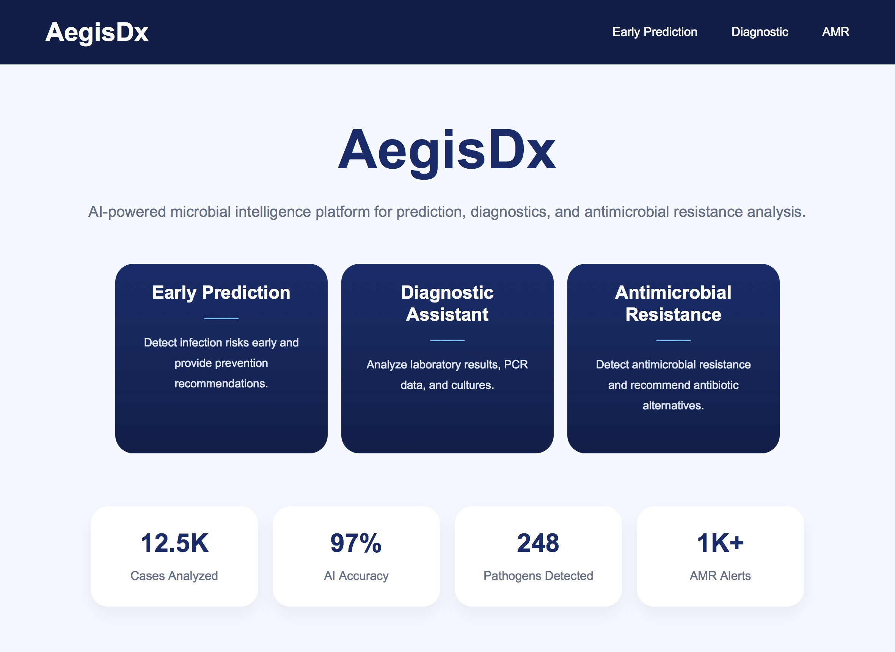
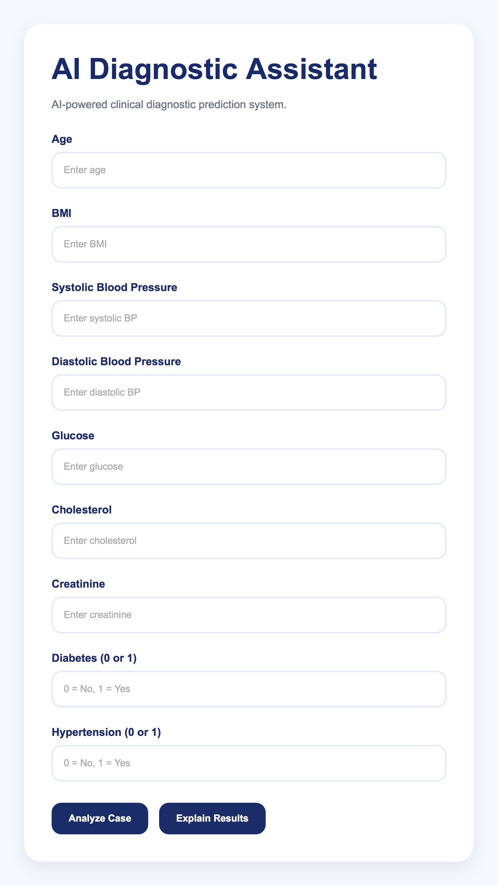
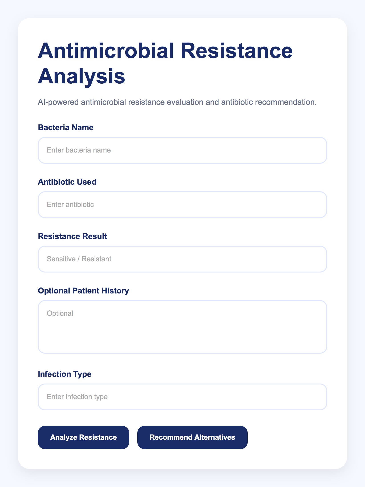
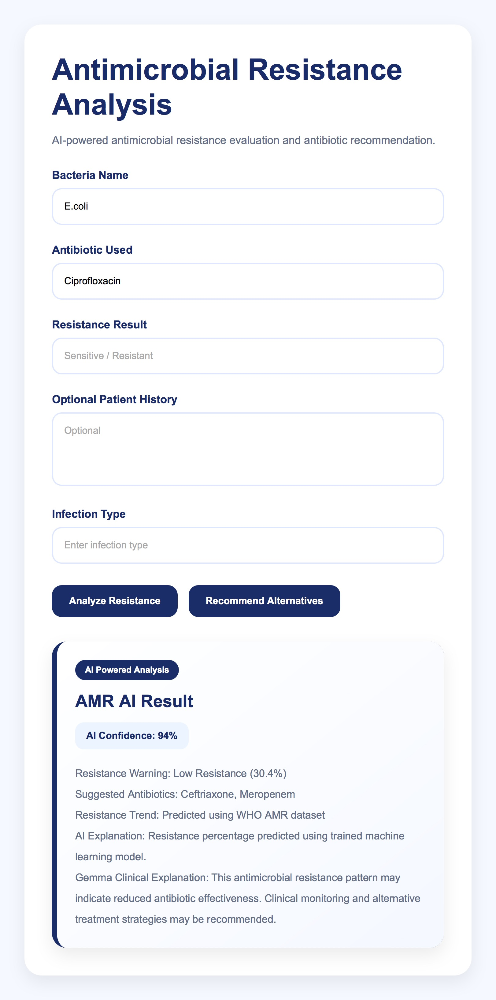

# AegisDx

## AI-Powered Healthcare Platform Using Gemma 4

AegisDx is an AI-powered healthcare platform developed to address three major medical challenges:

- Delayed diagnosis caused by expensive and time-consuming laboratory testing
- The spread of microbial diseases during diagnostic waiting periods
- The increasing threat of antimicrobial resistance (AMR)

To tackle these challenges, AegisDx provides an intelligent medical platform with three specialized healthcare sections:

1. Early Disease Prediction  
Helps identify potential diseases earlier using machine learning models.

2. Diagnostic Analysis  
Provides AI-assisted diagnostic interpretation and medical insights.

3. Antimicrobial Resistance Analysis  
Analyzes antimicrobial resistance risks to support better treatment decisions.

The platform combines machine learning models with Gemma 4 explainability to provide accessible, fast, and interpretable healthcare assistance.

---

## Gemma 4 Integration

Gemma 4 is integrated into AegisDx to generate explainable medical interpretations and grounded healthcare reasoning.

Gemma 4 is used to:
- Explain prediction results
- Generate understandable medical insights
- Improve transparency in AI-assisted healthcare
- Support healthcare accessibility and trust

This transforms the platform from a simple prediction tool into an explainable healthcare assistant.

---

## Technologies Used

- Python
- Flask
- Scikit-learn
- Hugging Face
- Gemma 4
- HTML/CSS
- Render

---

## Live Demo

https://aegisdx.onrender.com

---

## Screenshots

---

## Project Goal

The goal of AegisDx is to improve healthcare accessibility through explainable AI and intelligent medical assistance.

The platform aims to reduce diagnostic delays, support faster medical decision-making, and provide accessible healthcare tools for communities with limited medical resources.